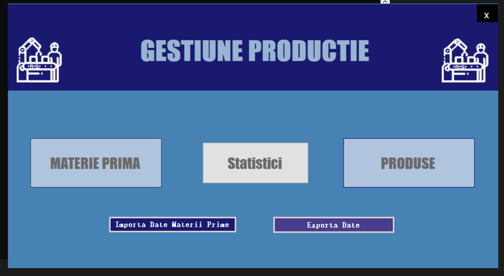
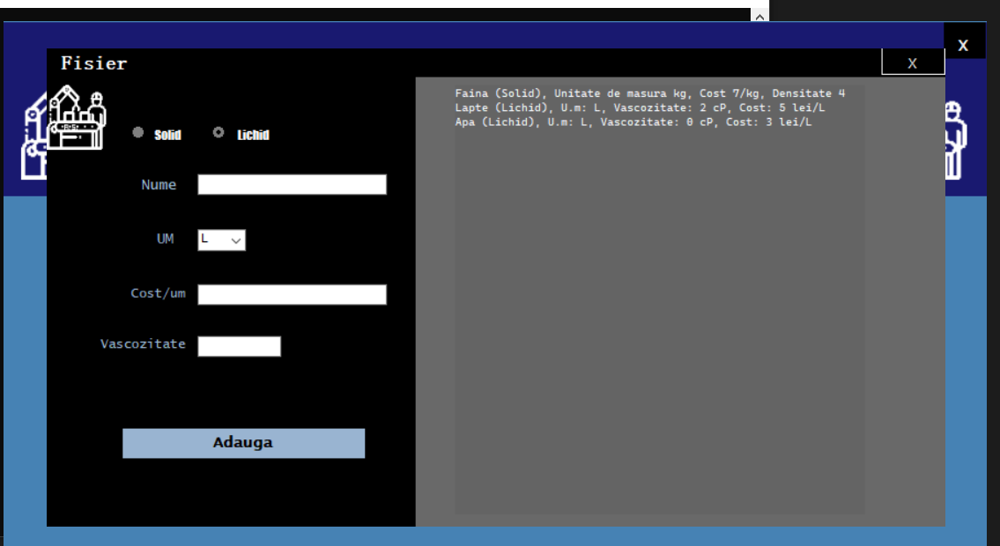
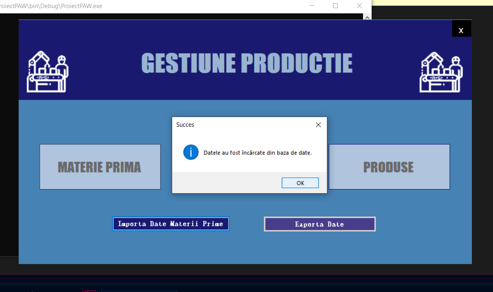
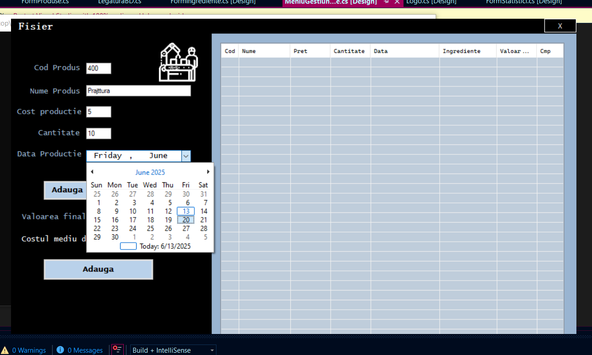
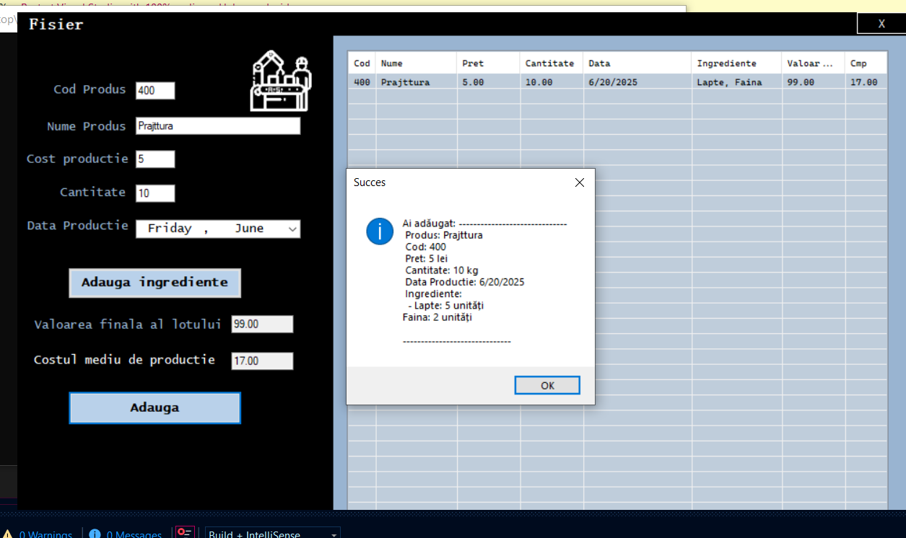
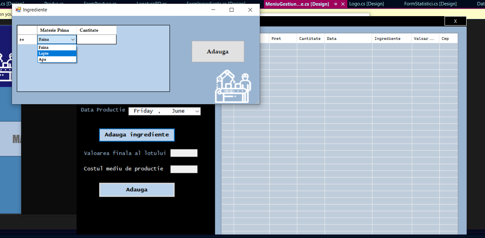
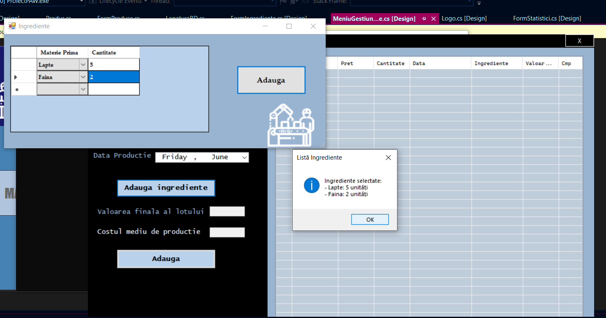
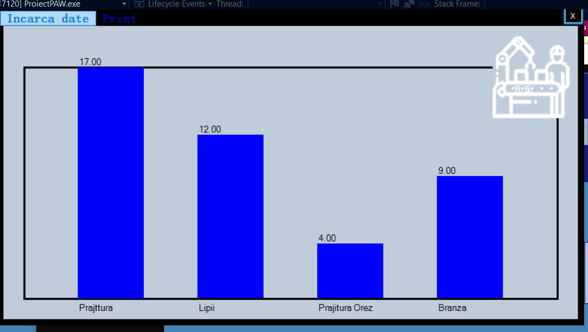

# 🏭 Gestiune Producție

A Windows Forms desktop application for managing raw materials, products, and production statistics. The project simulates a production environment, allowing users to define materials, calculate costs, track production batches, and export/import data.

---

## 🧩 Technologies Used

- 🖥️ C# with Windows Forms (WinForms)
- 📦 Microsoft Access (.accdb database)
- 📊 Charting components for production statistics
- 🗂️ Serialization for data import/export
- 📁 ADO.NET (OleDb) for database interaction

---
| Main Menu                           | Raw Materials                         | Database Communication                    |
| ----------------------------------- | ------------------------------------- | ----------------------------------------- |
|  |  |  |
| Product Input                    | Product Confirmation              | Ingredient Selection                       |
| -------------------------------- | --------------------------------- | ------------------------------------------ |
|  |  |  |
| Ingredient Confirmation                    | Cost Statistics                                   |
| --------------------------------- | --------------------------------------- |
|  |  |

---
## 🎯 Features

- **Manage Raw Materials**  
  Add, edit, and categorize materials (solid/liquid) with unit cost, viscosity, and unit of measure.

- **Manage Products**  
  Define products by combining raw materials and specifying production batches, quantity, and cost.

- **Live Cost Calculation**  
  Automatically compute batch value and average production cost based on selected ingredients.

- **Import/Export Data**  
  Export data to external files and import materials from `.txt` or `.accdb`.

- **Production Statistics**  
  Generate dynamic charts based on stored product data (using `System.Windows.Forms.DataVisualization`).

---

## 🗄️ Database

The application uses a **Microsoft Access database** (`.accdb`) for persistent storage of:

- Raw materials
- Products
- Production entries
- Ingredients per product

You can configure the connection string in `LegaturaBD.cs`.

---

## 🚀 How to Run

1. Clone the repository:
```bash
git clone https://github.com/USERNAME/ProiectPAW.git
